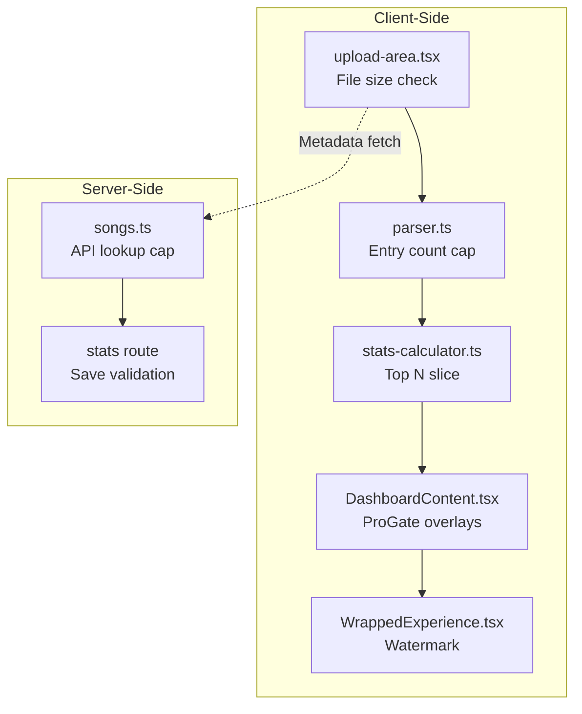

# Phase 4: Feature Gating & Limit Enforcement

> **Goal:** Wire up the shared components from Phase 3 into the existing upload flow, parser, stats API, dashboard, wrapped experience, and navigation — enforcing Free tier limits at every touchpoint.

---

## Prerequisites
- Phase 1–3 complete (DB schema, Polar integration, shared components)

---

## Overview: Where Limits Are Enforced



---

## Step 1: Gate the Upload Flow (File Size)

**File:** `app/upload/components/upload-area.tsx`

**What to change:** Before processing begins, check the file size against the Free tier limit. If it exceeds the limit, show the `<UpgradeModal>`.

### Changes Required

1. Import `useIsPremium` and `UpgradeModal`.
2. Add state for the upgrade modal.
3. In the `onDrop` callback, check `file.size` before calling `processFile`.

```diff
+ import { useIsPremium } from "@/hooks/use-premium";
+ import { UpgradeModal } from "@/components/upgrade-modal";

+ const FREE_TIER_MAX_FILE_SIZE = 10 * 1024 * 1024; // 10MB

  export function UploadArea() {
    const router = useRouter();
+   const { isPremium } = useIsPremium();
+   const [showUpgradeModal, setShowUpgradeModal] = useState(false);
    // ... existing state ...

    const onDrop = useCallback(
      async (acceptedFiles: File[]) => {
        if (acceptedFiles.length === 0) return;
        const file = acceptedFiles[0];

+       // Free tier file size check
+       if (!isPremium && file.size > FREE_TIER_MAX_FILE_SIZE) {
+         setShowUpgradeModal(true);
+         return;
+       }

        setUploadedFile(file);
        // ... rest of existing logic ...
      },
-     [processFile],
+     [processFile, isPremium],
    );

    // In the JSX return, add the modal at the end:
+   <UpgradeModal
+     open={showUpgradeModal}
+     onOpenChange={setShowUpgradeModal}
+     reason="Your file is larger than 10MB, which exceeds the Free tier limit. Upgrade to Pro to process your full Google Takeout history!"
+   />
```

Also update the dropzone `maxSize` to be conditional:
```diff
  const { getRootProps, getInputProps, isDragActive, isDragReject } =
    useDropzone({
      onDrop,
      accept: { "application/json": [".json"] },
      maxFiles: 1,
-     maxSize: 100 * 1024 * 1024,
+     maxSize: isPremium ? 500 * 1024 * 1024 : FREE_TIER_MAX_FILE_SIZE,
      disabled: isProcessing || stage === "success",
    });
```

---

## Step 2: Cap Parsed Entries (Parser)

**File:** `app/upload/components/upload-area.tsx` (in `processFile`)

After parsing completes but before metadata fetch, truncate the entries array for Free users:

```diff
  // Step 1: Parse the file
  const parseResult = await parseFile(file, ...);

+ // Free tier: cap entries
+ const FREE_TIER_MAX_ENTRIES = 15_000;
+ if (!isPremium && parseResult.entries.length > FREE_TIER_MAX_ENTRIES) {
+   parseResult.entries = parseResult.entries.slice(0, FREE_TIER_MAX_ENTRIES);
+   // Rebuild unique video IDs from truncated entries
+   const seenIds = new Set<string>();
+   parseResult.uniqueVideoIds = [];
+   for (const entry of parseResult.entries) {
+     if (entry.youtubeId && !seenIds.has(entry.youtubeId)) {
+       seenIds.add(entry.youtubeId);
+       parseResult.uniqueVideoIds.push(entry.youtubeId);
+     }
+   }
+ }
```

---

## Step 3: Cap YouTube API Lookups (Server Action)

**File:** `app/actions/songs.ts`

In the `lookupSongs` function, cap the number of video IDs for Free users.

### Changes Required

1. Import `isUserPremium` from `lib/services/premium.ts`.
2. After auth check, query premium status and apply a lower cap.

```diff
+ import { isUserPremium } from "@/lib/services/premium";

+ const FREE_TIER_MAX_LOOKUPS = 50;

  export async function lookupSongs(videoIds: string[]): Promise<LookupResult> {
    // ... existing auth checks ...

+   // Apply tier-based lookup limit
+   const billingEnabled = process.env.NEXT_PUBLIC_ENABLE_BILLING === "true";
+   if (billingEnabled) {
+     const premium = await isUserPremium(session.user.id);
+     const maxIds = premium ? MAX_VIDEO_IDS : FREE_TIER_MAX_LOOKUPS;
+     videoIds = videoIds.slice(0, maxIds);
+   }

    // ... existing lookup logic ...
  }
```

---

## Step 4: Gate Dashboard Analytics

**File:** `app/dashboard/components/DashboardContent.tsx`

Wrap premium sections with `<ProGate>`:

```diff
+ import { ProGate } from "@/components/pro-gate";

  // In the Insights tab content:
  <TabsContent value="insights" className="space-y-6">
-   <SongAge stats={stats} />
+   <SongAge stats={stats} />

-   <ListeningPatterns stats={stats} />
+   <ProGate label="Unlock listening heatmaps with Pro">
+     <ListeningPatterns stats={stats} />
+   </ProGate>

    {/* ... rest of insights ... */}
  </TabsContent>
```

### Add Disabled Export Button

Add an export button to the dashboard header that is disabled for Free users:

```diff
+ import { Download } from "lucide-react";
+ import { useIsPremium } from "@/hooks/use-premium";

  // Inside the header flex container:
+ const { isPremium } = useIsPremium();

  <div className="flex items-center space-x-3">
    {/* ... existing badges ... */}
+   <Button
+     variant="outline"
+     size="sm"
+     className="gap-1.5"
+     disabled={!isPremium}
+     title={isPremium ? "Export your stats" : "Pro feature"}
+   >
+     <Download className="h-3.5 w-3.5" />
+     Export
+     {!isPremium && <span className="text-xs opacity-60">PRO</span>}
+   </Button>
  </div>
```

---

## Step 5: Gate the Top Lists (Slice Arrays)

**File:** `app/dashboard/components/TopSongs.tsx` and `TopArtists.tsx`

Free users see Top 10 songs and Top 5 artists. Pro users see the full lists.

```diff
+ import { useIsPremium } from "@/hooks/use-premium";

  export function TopSongs({ stats }: { stats: IUserStats }) {
+   const { isPremium } = useIsPremium();
    const songs = stats.topSongs || [];
-   const displaySongs = songs.slice(0, 10);
+   const displaySongs = isPremium ? songs : songs.slice(0, 10);

    // ... render ...
+   {!isPremium && songs.length > 10 && (
+     <div className="text-center py-4 text-sm text-muted-foreground">
+       <a href="/pricing" className="text-foreground underline">
+         Upgrade to Pro
+       </a>{" "}
+       to see your full Top {songs.length} songs
+     </div>
+   )}
  }
```

Apply the same pattern to `TopArtists.tsx` with a limit of 5 for Free users.

---

## Step 6: Add Watermark to Wrapped Shareable

**File:** `app/wrapped/components/slides/SummarySlide.tsx`

When Free users share their Wrapped image, include a subtle watermark.

```diff
+ import { useIsPremium } from "@/hooks/use-premium";

  // Inside the SummarySlide component:
+ const { isPremium } = useIsPremium();

  // In the shareable container:
+ {!isPremium && (
+   <div className="absolute bottom-2 right-3 text-[10px] text-white/40 font-medium">
+     ytmusicstats.com
+   </div>
+ )}
```

---

## Step 7: Update Navigation with Upgrade CTA

**File:** `components/Navigation.tsx`

Add the `<UpgradeButton>` for Free users and `<ProBadge>` for Pro users.

```diff
+ import { useIsPremium } from "@/hooks/use-premium";
+ import { UpgradeButton } from "@/components/upgrade-button";
+ import { ProBadge } from "@/components/pro-badge";

  export function Navigation() {
    const { isAuthenticated, isLoading } = useAuth();
+   const { isPremium, isLoading: premiumLoading } = useIsPremium();
    // ...

    // In the authenticated desktop nav section, add before the SignOut button:
+   {isAuthenticated && !premiumLoading && (
+     isPremium
+       ? <ProBadge />
+       : <UpgradeButton size="sm" />
+   )}
```

---

## Step 8: Pass `isPremium` from Server Pages (Optimization)

For server-rendered pages, pass `isPremium` as a prop to avoid a client-side fetch.

**File:** `app/dashboard/page.tsx`

```diff
- import { auth } from "@/lib/auth/config";
+ import { getSessionWithPremium } from "@/lib/auth/helpers";

  export default async function DashboardPage() {
-   const session = await auth.api.getSession({
-     headers: await headers(),
-   });
+   const session = await getSessionWithPremium();

    if (!session?.user) {
      redirect("/auth/signin");
    }

    // ... existing stats query ...

    return (
      <DashboardContent
        stats={stats}
+       isPremium={session.isPremium}
      />
    );
  }
```

Then update `DashboardContent` to accept `isPremium` as a prop and use it instead of the hook where possible.

---

## Enforcement Summary Table

| Limit | Free Value | Pro Value | Enforced In | How |
| :--- | :--- | :--- | :--- | :--- |
| File size | 10 MB | 500 MB | `upload-area.tsx` | Modal before parse |
| Entry count | 15,000 | Unlimited | `upload-area.tsx` | Slice after parse |
| API lookups | 50 IDs | 8,000 IDs | `songs.ts` | Server-side cap |
| Top Songs displayed | 10 | 100+ | `TopSongs.tsx` | Array slice |
| Top Artists displayed | 5 | 50+ | `TopArtists.tsx` | Array slice |
| Listening Patterns | Locked | Full | `DashboardContent.tsx` | `<ProGate>` |
| Share watermark | Yes | No | `SummarySlide.tsx` | Conditional render |
| Data export | Disabled | Enabled | `DashboardContent.tsx` | Button disabled |
| Stats retention | 30 days | Lifetime | Cron job (future) | DB purge query |

---

## Verification Checklist

- [ ] Free user sees `<UpgradeModal>` when uploading a file > 10MB
- [ ] Free user's parsed entries are capped at 15,000
- [ ] Free user's API lookups are capped at 50 IDs
- [ ] Free user sees Top 10 songs, Top 5 artists with "Upgrade" link
- [ ] `<ProGate>` blurs the ListeningPatterns section for Free users
- [ ] Export button is disabled with "PRO" label for Free users
- [ ] Wrapped share image has watermark for Free users
- [ ] Navigation shows "⚡ Upgrade" for Free, "PRO" badge for Pro
- [ ] All above features work normally (unrestricted) for Pro users
- [ ] With `NEXT_PUBLIC_ENABLE_BILLING=false`, everything is unrestricted
- [ ] `pnpm type-check` and `pnpm check` pass
